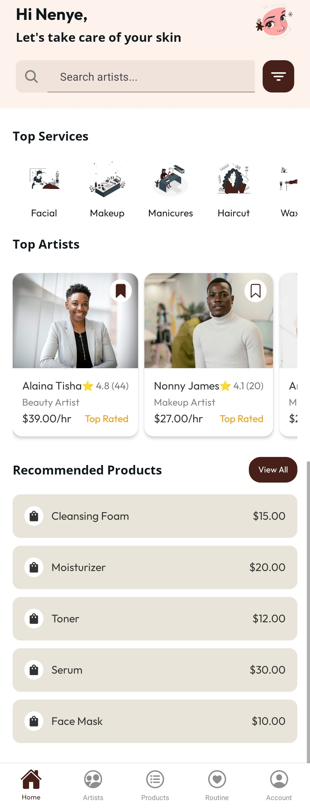

# Glowdrop

Glowdrop is a **Professional Service & Beauty Product App** designed to help users connect with top-rated beauty professionals, discover products, and create personalized beauty routines. Built with **React Native** and **TypeScript**, Glowdrop combines service booking with product recommendations to deliver a comprehensive beauty and self-care experience.

---

## Tech Stack

- **React Native**: For creating a cross-platform mobile application that runs on both iOS and Android.
- **TypeScript**: Used for type safety, enhancing code maintainability, and ensuring a robust development experience.
  
---

## Features

### Professional Services
- **Professional Profiles**: Detailed profiles for each beauty professional, showcasing:
  - **About** section
  - **Services** with descriptions, durations, and prices
  - **Availability** schedule by day
  - **Contact Information** (phone number, email, and address)
  - **Reviews** from clients, with ratings and comments

- **User Actions**:
  - Bookmark professionals for easy access
  - Book services directly from the profile page
  - Filter by ratings, price, and availability

### Product Discovery
- **Beauty Products**: Browse a curated list of beauty products recommended by professionals.
- **Product Details**: View detailed information for each product, including benefits, ingredients, and user reviews.
<!-- - **Add to Routine**: Easily add products to a personal beauty routine for daily use. -->

### Personalized Routine
- **Routine Builder**: Create and manage a personalized routine by adding selected products and specifying usage frequency.
<!-- - **Reminders**: Set reminders for specific routine steps, helping users maintain their beauty regimen. -->

---

## App Screenshots

Here are some demo pictures of the Glowdrop app, showcasing its user-friendly interface and features:

| Screen          | Screenshot                                |
|------------------|------------------------------------------|
| Auth Screen      |   |
| Home Screen      |   |
| Professional List|  |
| Professional Detail About Tab screen|  |
| Professional Detail Services Tab screen|  |
| Professional Detail Reviews Tab screen  |  |
| Product Details  |  |
| Routine Builder   |  |

---

## Design Inspiration

Glowdrop’s sleek and modern design draws inspiration from the following Dribbble concepts, blending clean layouts with engaging visuals:
- [Beauty Service App UI](https://dribbble.com/shots/22017249-Beauty-Service-App-UI): Provided inspiration for the color scheme and general aesthetic, specifically the home screen, artists/professional listing, professional detail screens.
- [Home Cleaning Service App UI](https://dribbble.com/shots/21975282-Home-Cleaning-Service-App-UI): Influenced the product detail screen.
- [Skin Care App Design](https://dribbble.com/shots/21700382-Skin-Care-App-design): Provided inspiration for the product and routine sections.
- [Inventory App Design](https://dribbble.com/shots/24566846-Inventory-app-Profile): Provided inspiration for the account section.

---

## Getting Started

1. **Clone the Repository**:
   ```bash
   git clone https://github.com/kodervine/glowdrop.git
   ```
2. **Install Dependencies**:
   ```bash
   cd glowdrop
   npm install
   ```
3. **Run the App**:
   ```bash
   npx expo start # or npm run ios for iOS
   ```

---

## Folder Structure

- **components**: Contains reusable UI components used throughout the app.
- **screens**: Major screens like Home, Artists, Routine, Products, and Routine.
- **assets**: Includes images, icons, and other static files.
- **types**: TypeScript interfaces and types for data consistency across components.

---

Glowdrop is your one-stop beauty service and product app, built to provide a streamlined experience in booking services, discovering products, and maintaining a beauty routine. 

---
